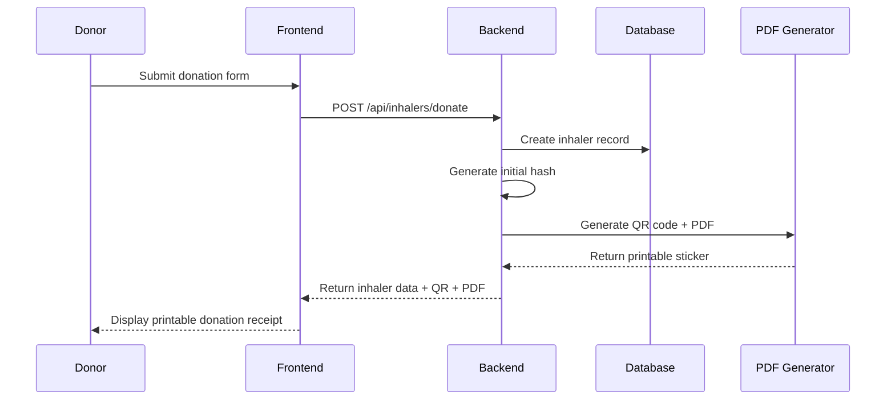
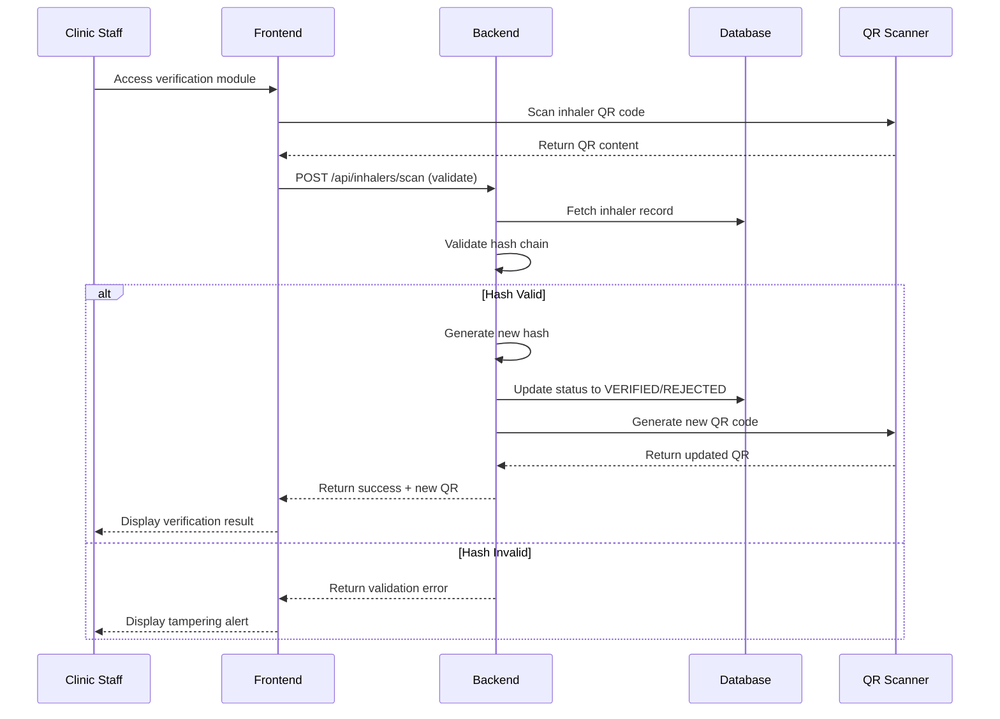
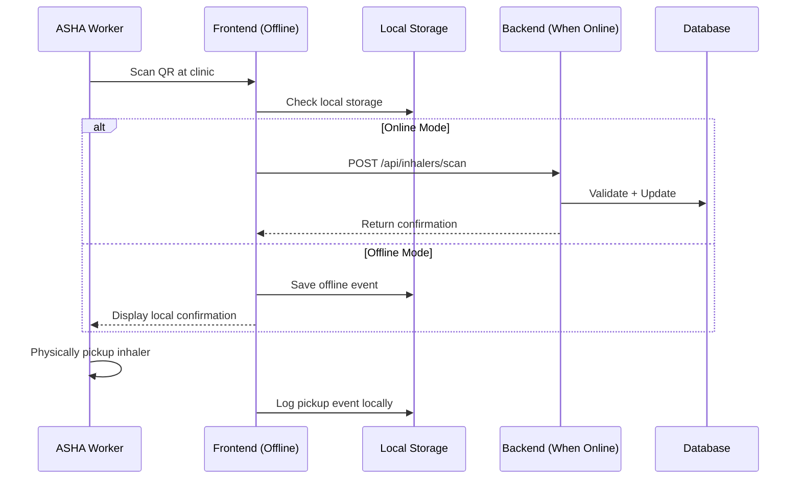
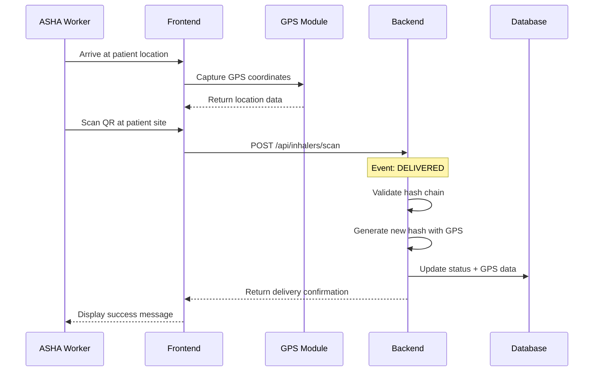
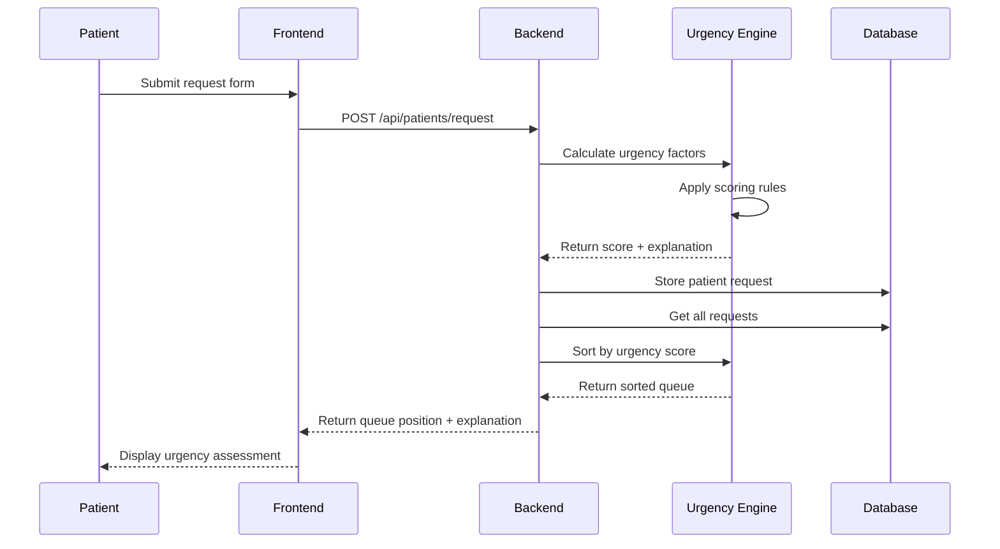
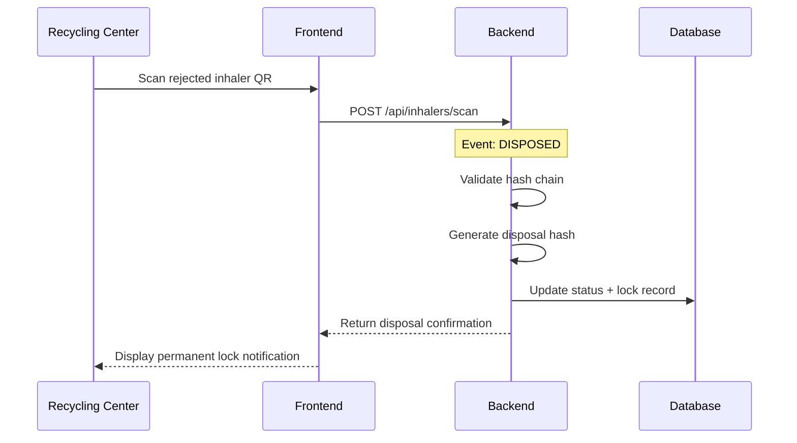
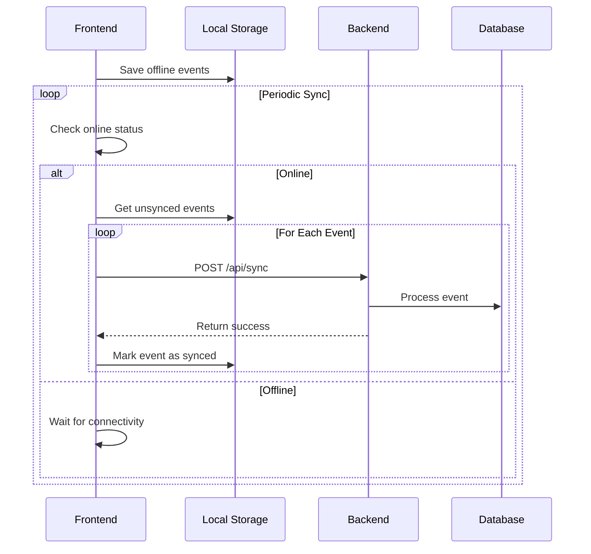
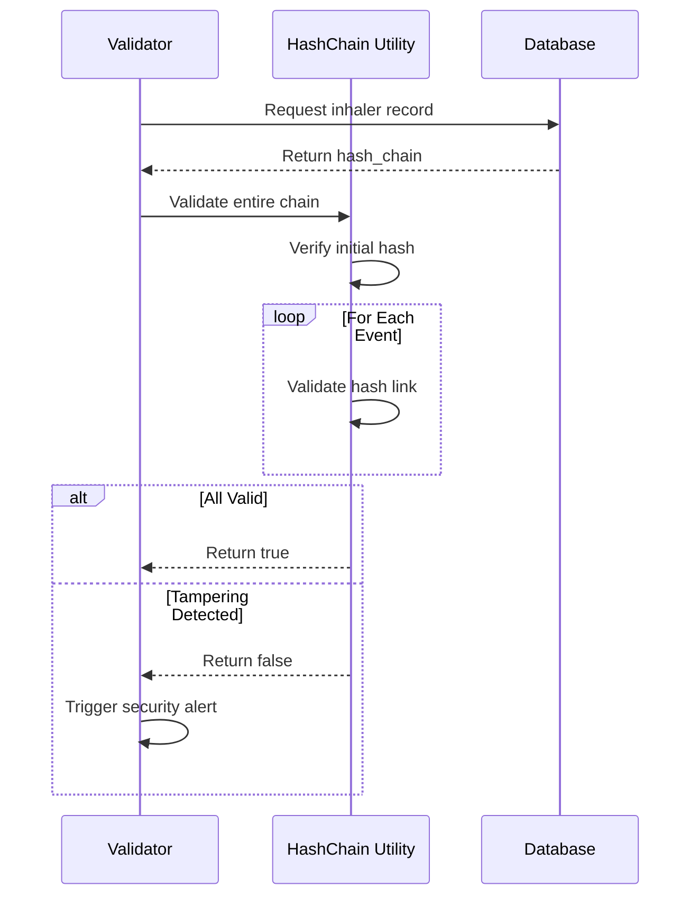
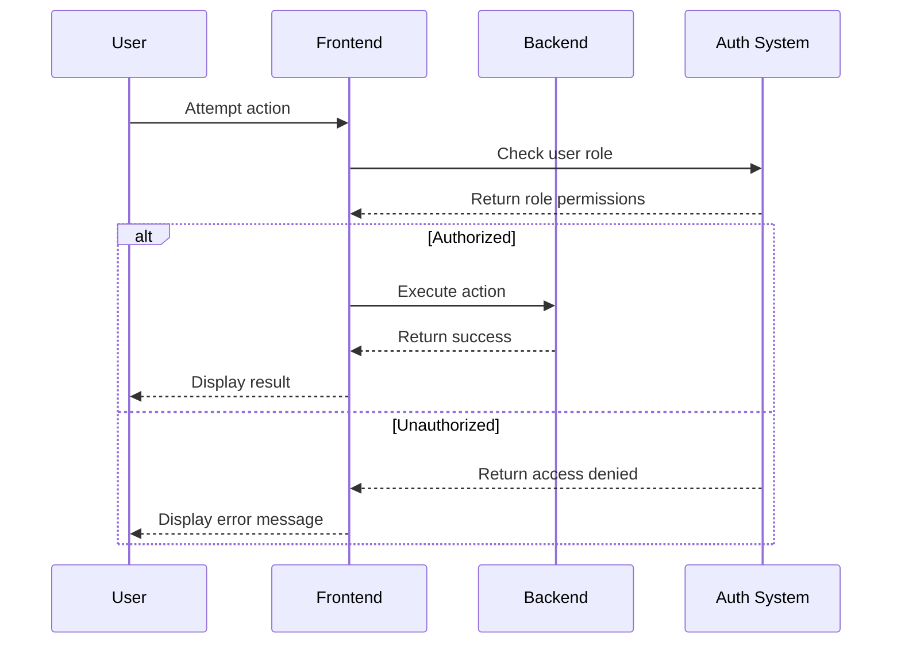

# VIX System Sequence Diagrams

## 1. DONATION FLOW

## 2. CLINIC VERIFICATION FLOW

## 3. ASHA PICKUP FLOW

## 4. ASHA DELIVERY FLOW

## 5. PATIENT MATCHING FLOW (AI COMPONENT)

## 6. RECYCLING FLOW

## 7. OFFLINE SYNC FLOW

## 8. HASH CHAIN VALIDATION

## 9. SECURITY & ACCESS CONTROL

## Key Security Features:

1. **Tamper-Evident Logging**: Every state change generates cryptographically linked hash
2. **Offline-First Design**: ASHA workers can function without internet connectivity
3. **Deterministic AI**: Rule-based urgency scoring with full explainability
4. **Role-Based Access**: Clinic/ASHA/Recycling roles with specific permissions
5. **End-to-End Validation**: QR codes contain current hash for instant verification
6. **Immutable Audit Trail**: Hash chain ensures complete transaction history
7. **Conflict Resolution**: Latest valid hash wins in sync conflicts
8. **Exponential Backoff**: Robust retry mechanism for offline sync